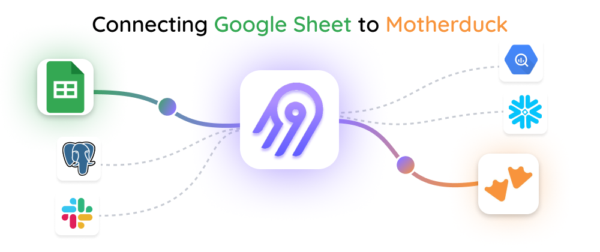
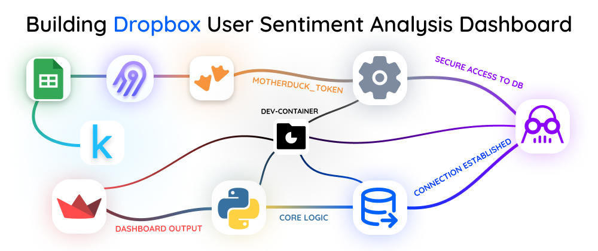

<div style="text-align: center; margin-bottom: 20px;">
    
</div>
<div style="text-align: center; margin-bottom: 20px;">
    
</div>
---

# Dropbox User Sentiment Analysis 🗳️

Welcome to the **Dropbox User Sentiment Analysis** project! This repository is part of the **Airbyte + Motherduck Hackathon**, showcasing how to integrate **Google Sheets** with **Motherduck** using Airbyte. The goal? To build an insightful **Sentiment Analysis Dashboard** for Dropbox app reviews! 🚀

---

## 🎩 Overview

Analyze user reviews of the Dropbox app using sentiment analysis techniques! Here’s how:

1. 📊 **Dataset Source**: User reviews from Kaggle, formatted via Google Sheets.
2. ⚙️ **Data Integration**: Sync Google Sheets with Motherduck using Airbyte.
3. 🛠️ **Data Storage**: Leverage Motherduck’s DuckDB-based cloud storage.
4. 🔄 **Sentiment Analysis**: Use Python and TextBlob to uncover user sentiments.
5. 🎮 **Interactive Dashboard**: Visualize insights with Streamlit.

---

## 🛠 Tech Stack

- **Airbyte** ✨: Seamless data integration platform.
- **Motherduck** 🦆: Lightweight cloud-based DuckDB engine.
- **Python** 🐟: Programming language for analysis and visualization.
- **Streamlit** 🚀: Build and share beautiful dashboards.
- **TextBlob** 🍃: Perform sentiment analysis on text reviews.

---

## 🔧 Setup Instructions

### Prerequisites 🆒

1. **Airbyte**: [Install Airbyte](https://docs.airbyte.com) locally or use the cloud version.
2. **Motherduck**: [Sign up for Motherduck](https://motherduck.com).
3. **Python Environment**: Ensure Python 3.8+ is installed.
4. **Google Sheets Dataset**: Upload the CSV dataset to Google Sheets.

### Step 1: Configure Airbyte 💡

1. **Login to Airbyte**: Access your Airbyte workspace.
2. **Create a New Connection**:
   - Select **Google Sheets** as the source.
   - Choose **Motherduck** as the destination.
3. **Authentication**:
   - Grant access to the Google Sheets dataset.
   - Input the **Motherduck token**.
4. **Sync Schedule**:
   - Set up automatic syncing to keep Motherduck updated.

### Step 2: Configure Motherduck 🦆

1. **Sign Up**: Create an account on [Motherduck](https://motherduck.com).
2. **Generate API Key**:
   - Navigate to **Settings** > **General**.
   - Generate and copy your token.
3. **Validate Connection**:
   - Check data transfer using a sample SQL query.

---

## 🎮 Sentiment Analysis Dashboard

### Run the Application 🌐

1. Clone this repository:

   ```bash
   git clone https://github.com/abhirajadhikary06/dropbox-user-sentiment-analysis.git
   cd dropbox-user-sentiment-analysis
   ```

2. Install dependencies:

   ```bash
   pip install -r requirements.txt
   ```

3. Run the Streamlit app:

   ```bash
   streamlit run src/app.py
   ```

4. Open the app in your browser at [http://localhost:8501](http://localhost:8501).

### Features 📊

- **Sentiment Distribution**: View the distribution of sentiments.
- **Sentiment by Rating**: Explore how ratings correlate with sentiments.
- **Sample Reviews**: Read categorized reviews (Positive, Neutral, Negative).
- **Filters**: Switch between sentiment polarity and subjectivity.

---

## 🗂️ Project Structure

```
Dropbox User Sentiment Analysis/
|-- src/
|   |-- app.py  # Streamlit dashboard
|   |-- utils/
|       |-- database.py  # Database connection and queries
|-- config/
|   |-- config.py  # Configuration file (API keys, tokens)
|-- requirements.txt  # Python dependencies
|-- README.md  # Project documentation
```

---

## 🔒 License

This project is licensed under the CC0-1.0 License. See the `LICENSE` file for details.

---

## 📢 Stay Connected

Have feedback or ideas? 😊 Feel free to reach out or contribute to this repository. Let’s make data integration and sentiment analysis accessible for everyone!

